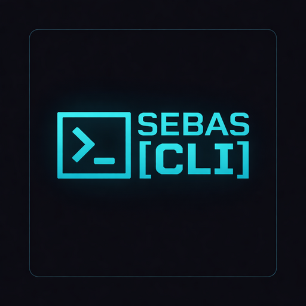

# Sebas CLI

> Terminal de escritorio sci-fi basada en eDEX-UI.
> Funciona en **Linux**, **macOS** y **Windows**.

<p align="center">
  
</p>

---

## Descargar

Los binarios se actualizan automaticamente con cada cambio. Descargar desde:

**https://github.com/henao06/sebas-cli-releases/releases/tag/latest**

---

## Instalacion

<p align="center">

[](#linux) [](#macos) [](#windows)

</p>

---

## Linux

### Paso 1 — Descargar el AppImage

Descargarlo desde la [pagina de releases](https://github.com/henao06/sebas-cli-releases/releases/tag/latest) eligiendo el archivo segun tu arquitectura:

O usando la terminal (requiere [GitHub CLI](https://cli.github.com/)):

```bash
# Solo Linux — detecta tu arquitectura y descarga el AppImage correcto
ARCH=$(uname -m)
case $ARCH in
  x86_64)  PATTERN="*x86_64.AppImage" ;;
  aarch64) PATTERN="*arm64.AppImage" ;;
  armv7l)  PATTERN="*armv7l.AppImage" ;;
  *) echo "Arquitectura no soportada: $ARCH"; exit 1 ;;
esac

gh release download latest --repo henao06/sebas-cli-releases --pattern "$PATTERN" --clobber
```

| Arquitectura | Cuando usarlo |
|---|---|
| `*x86_64.AppImage` | PC o laptop con Intel o AMD |
| `*arm64.AppImage` | Raspberry Pi 4, servidores ARM modernos |
| `*armv7l.AppImage` | Raspberry Pi 2/3, dispositivos ARM viejos |

### Paso 2 — Instalar FUSE

Los AppImage lo requieren para ejecutarse. Ejecuta el comando segun tu distro:

```bash
# Debian / Ubuntu / Mint
sudo apt install libfuse2
```
```bash
# Fedora / RHEL
sudo dnf install fuse
```
```bash
# Arch
sudo pacman -S fuse2
```

### Paso 3 — Instalar en el sistema

Copia y pega este bloque completo en la terminal. Detecta automaticamente el AppImage descargado, lo instala, y crea el comando `sebas-cli` y el acceso en el menu de aplicaciones:

```bash
APPIMAGE=$(find ~ -maxdepth 2 -iname "*sebas*cli*.AppImage" -type f 2>/dev/null | head -1) && \
if [ -z "$APPIMAGE" ]; then echo "No se encontro ningun AppImage en la carpeta actual"; else \
sudo mkdir -p /opt/sebas-cli && \
sudo cp "$APPIMAGE" /opt/sebas-cli/sebas-cli.AppImage && \
sudo chmod +x /opt/sebas-cli/sebas-cli.AppImage && \
cd /tmp && /opt/sebas-cli/sebas-cli.AppImage --appimage-extract "*.png" > /dev/null 2>&1; \
ICON=$(find /tmp/squashfs-root -iname "*.png" -type f 2>/dev/null | head -1) && \
if [ -n "$ICON" ]; then sudo cp "$ICON" /opt/sebas-cli/sebas-cli.png; fi; \
rm -rf /tmp/squashfs-root 2>/dev/null; \
echo '#!/bin/bash
/opt/sebas-cli/sebas-cli.AppImage --no-sandbox "$@"' | sudo tee /usr/local/bin/sebas-cli > /dev/null && \
sudo chmod +x /usr/local/bin/sebas-cli && \
cat << 'DESKTOP' | sudo tee /usr/share/applications/sebas-cli.desktop > /dev/null
[Desktop Entry]
Name=Sebas CLI
Comment=Sci-fi terminal emulator
Exec=/opt/sebas-cli/sebas-cli.AppImage --no-sandbox
Icon=/opt/sebas-cli/sebas-cli.png
Terminal=false
Type=Application
Categories=System;TerminalEmulator;
StartupWMClass=Sebas CLI
DESKTOP
echo "Sebas CLI instalado. Ejecuta: sebas-cli"; fi
```

### Paso 4 — Ejecutar

```bash
sebas-cli
```

O buscar **"Sebas CLI"** en el menu de aplicaciones.

### Actualizar

Si ya tenes Sebas CLI instalado, descarga el nuevo AppImage y ejecuta:

```bash
APPIMAGE=$(find ~ -maxdepth 2 -iname "*sebas*cli*.AppImage" -type f 2>/dev/null | head -1) && \
if [ -z "$APPIMAGE" ]; then echo "No se encontro ningun AppImage en la carpeta actual"; else \
pkill -f "sebas-cli" 2>/dev/null; sleep 1; \
sudo cp "$APPIMAGE" /opt/sebas-cli/sebas-cli.AppImage && \
sudo chmod +x /opt/sebas-cli/sebas-cli.AppImage && \
echo "Sebas CLI actualizado."; fi
```

### Errores comunes

| Error | Solucion |
|---|---|
| `error loading libfuse.so.2` | `sudo apt install libfuse2` |
| `Running as root without --no-sandbox` | No uses `sudo` para ejecutar la app |
| `Another instance is already running` | `pkill -f "Sebas CLI"` y volver a abrir |
| La app no aparece en el menu | Cerrar sesion y volver a entrar |

### Desinstalar

```bash
sudo rm -rf /opt/sebas-cli /usr/local/bin/sebas-cli /usr/share/applications/sebas-cli.desktop
```

[](#instalacion)

---

## macOS

### Paso 1 — Descargar el .dmg

Desde la [pagina de releases](https://github.com/henao06/sebas-cli-releases/releases/tag/latest) descargar el archivo `*.dmg`.

### Paso 2 — Instalar

1. Abrir el `.dmg` descargado
2. Arrastrar **Sebas CLI** a la carpeta **Applications**
3. Cerrar el DMG

### Paso 3 — Ejecutar

Buscar **"Sebas CLI"** en Launchpad o Spotlight (`Cmd+Space`).

> Si macOS bloquea la app al abrirla: **Configuracion del Sistema > Privacidad y Seguridad > "Abrir de todas formas"**

### Desinstalar

```bash
rm -rf /Applications/Sebas\ CLI.app
```

[](#instalacion)

---

## Windows

### Paso 1 — Descargar el instalador

Desde la [pagina de releases](https://github.com/henao06/sebas-cli-releases/releases/tag/latest) descargar el archivo `*Windows*.exe`.

### Paso 2 — Instalar

1. Ejecutar el `.exe` descargado
2. Elegir directorio de instalacion
3. Click en **Instalar**

Crea acceso directo en el escritorio y en el menu Inicio automaticamente.

### Paso 3 — Ejecutar

Doble click en el acceso directo del escritorio o buscar **"Sebas CLI"** en el menu Inicio.

### Desinstalar

**Configuracion > Aplicaciones > Sebas CLI > Desinstalar**

[](#instalacion)

---

## Creditos

Basado en [eDEX-UI](https://github.com/GitSquared/edex-ui) por Gabriel Saillard (MIT).
